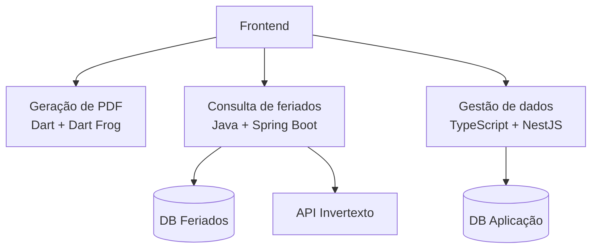

# timesheet

Plataforma para criação de folhas de ponto com geração automática de PDFs, gerenciamento de usuários e integração com API de feriados.

## Visão geral

O controle de jornada de trabalho ainda é realizado de forma manual em muitas empresas, especialmente em equipes menores ou em organizações
que não possuem um sistema dedicado para essa finalidade. Nesse cenário, é comum que as folhas de ponto sejam criadas a partir de planilhas,
modelos prontos ou documentos preenchidos manualmente a cada mês.

Esse processo exige a atualização constante das informações dos colaboradores, a verificação de datas, finais de semana e feriados, além da
geração individual dos documentos para impressão, assinatura ou arquivamento. À medida que o número de funcionários aumenta, essas tarefas se
tornam repetitivas, consomem tempo e aumentam a probabilidade de erros operacionais.

Este projeto surgiu da necessidade de simplificar esse fluxo. A proposta é centralizar as informações dos usuários e automatizar a criação das
folhas de ponto, reduzindo atividades manuais que normalmente precisam ser repetidas todos os meses.

A plataforma permite o gerenciamento de usuários, a geração automática de folhas de ponto em PDF e a consulta de feriados por meio de uma API
externa. Dessa forma, o sistema consegue produzir documentos de maneira mais consistente, considerando informações que, em um processo manual,
precisariam ser verificadas individualmente.

O objetivo não é substituir processos de controle de jornada mais complexos, mas fornecer uma solução que automatize etapas operacionais comuns,
tornando a geração de folhas de ponto mais rápida, organizada e menos sujeita a inconsistências.

## Arquitetura

A aplicação foi organizada em três microserviços independentes, cada um responsável por uma área específica do domínio. Essa separação permite
manter responsabilidades bem definidas, simplificar a manutenção e possibilitar a evolução de cada serviço de forma isolada.

Os microserviços não possuem comunicação direta entre si. Cada serviço expõe sua própria API e pode ser consumido de forma independente. A integração
entre eles acontece na camada de frontend, que realiza as chamadas necessárias para cada serviço e consolida as informações utilizadas pela aplicação.

Atualmente, a arquitetura é composta por:

- um serviço de **geração de PDF** desenvolvido em [Dart](https://dart.dev/) usando o _framework_ [Dart Frog](https://dart-frog.dev/), que é responsável
  pela geração das folhas de ponto a partir dos dados enviados pelo cliente
- um serviço de **feriados** desenvolvido em [Java](https://www.java.com/) com [Spring Boot](https://spring.io/), que atua como uma camada intermediária
  para consulta de feriados, armazenando em cache as informações obtidas pela [API do Invertexto](https://api.invertexto.com/api-feriados) e reduzindo
  chamadas externas
- um serviço de **gestão de dados** desenvolvido em [Typescript](https://www.typescriptlang.org/) com [NestJS](https://nestjs.com/), que concentra os
  dados utilizados pela aplicação e é responsável pelo gerenciamento de funcionários, feriados adicionais cadastrados manualmente e registros de faltas
  acompanhados de suas respectivas justificativas, como atestados médicos.

